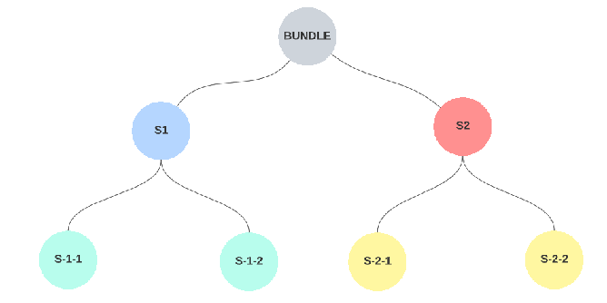

# Create basic collection with nested tokens

## Nesting and Bundling

Please follow [the link](https://docs.unique.network/concepts/network-features/nesting-bundling.html) to find detailed information regarding Nesting and Bundling. 

## Description
You can easily create a collection with nested tokens by running this application with appropriate parameters like owner seed, network, required number of tokens and the nesting depth of a bundle. 

To create basic collection follow the steps below.

### Step 1: update **env.json**
In the `env.json` file add the following data:
* A Seed Phrase of the collection owner (you can use Seed Phrase of your own test account). 

    **NOTE**: the collection owner must have sufficient balance for creation a new collection.
* Network.  

    **NOTE**: For testing purposes we usually use **OPAL** network so **DO NOT** change the endpoint and leave it as is: `wss://ws-opal.unique.network`

### Step 2: update **MyClient.ts**
In the `MyClient.ts` add the the collection owner address to the constructor. 

Optionally you can change name, description and prefix of the collection in `init()` method.

### Step 3: update **index.ts**
In the `MyClient.ts` you can specify the depth of the created tokens when calling `MyClient.magic` (e.g. (2, 2), (3, 3)).

For example, with (2, 2) depth the following token structure is created.




**NOTE**: Token creation time depends on the required depth of the bundle. For example, the bundle with depth (2, 2) would be created in 5 minutes while creation (3, 3) bundle would take about 30 minutes. Maximum available depth is 5. 

### Step 4: npm install
Execute following commands in the terminal.

```
npm install
```

### Step 5: run the app
Execute following commands in the terminal.

```
npx ts-node index.ts
```

Once it's complete the collection with appropriate bundles will be available.